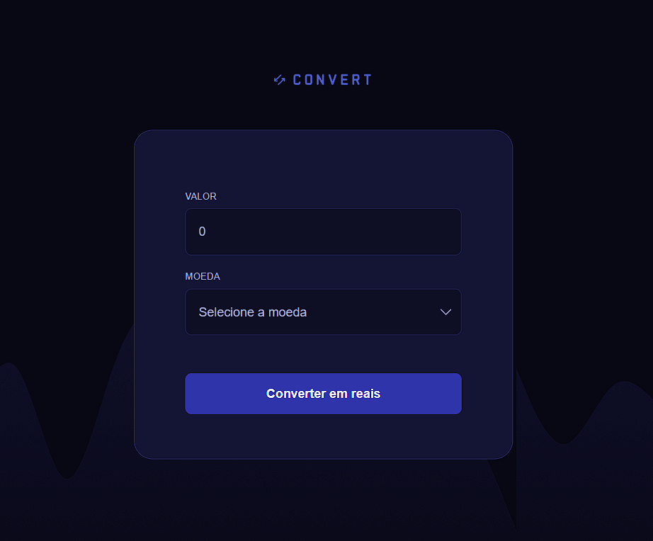

Conversor de Moedas 💱
Projeto desenvolvido durante a trilha Fullstack da Rocketseat. Este conversor permite calcular o valor em Reais (BRL) a partir de três moedas estrangeiras: Dólar (USD), Euro (EUR) e Libra Esterlina (GBP).

📸 Preview

🚀 Tecnologias Utilizadas
HTML5

CSS3

JavaScript (Vanilla)

⚙️ Funcionalidades
✅ Conversão de Dólar (USD), Euro (EUR) e Libra Esterlina (GBP) para Real (BRL)

✅ Validação do campo de entrada permitindo apenas números

✅ Formatação do resultado em Real Brasileiro (R$) no padrão local pt-BR

✅ Feedback visual com exibição de cotação e resultado

✅ Tratamento de erros simples para entradas inválidas

💻 Como utilizar
Clone o repositório:

git clone https://github.com/gabrielsb1/conversor-de-moedas.git
Abra o arquivo index.html no seu navegador.

Informe o valor, selecione a moeda desejada e clique em Converter em reais.

📂 Estrutura do Projeto

📦 conversor-moedas
 ┣ 📦 img
 ┣ 📄 index.html
 ┣ 📄 style.css
 ┗ 📄 script.js
📜 Código JavaScript - Principais partes

const USD = 5.49
const EUR = 6.37
const GBP = 7.44

amount.addEventListener("input", ()=> {
  const hasCharactersRegex = /\D+/g
  amount.value = amount.value.replace(hasCharactersRegex, "")
})

form.onsubmit = (e) => {
  e.preventDefault()
  switch(currency.value) {
    case "USD": convertCurrency(amount.value, USD, 'US$'); break;
    case "EUR": convertCurrency(amount.value, EUR, '€'); break;
    case "GBP": convertCurrency(amount.value, GBP, '£'); break;
  }
}
📌 Melhorias Futuras (Sugestões)
🔄 Atualização automática das cotações em tempo real via API

🌙 Modo claro/escuro

📱 Responsividade aprimorada

🌐 Outras moedas e idiomas

📚 Créditos
Projeto realizado através do curso Fullstack da Rocketseat.

📝 Licença
Esse projeto está sob a licença MIT. Veja o arquivo LICENSE para mais detalhes.